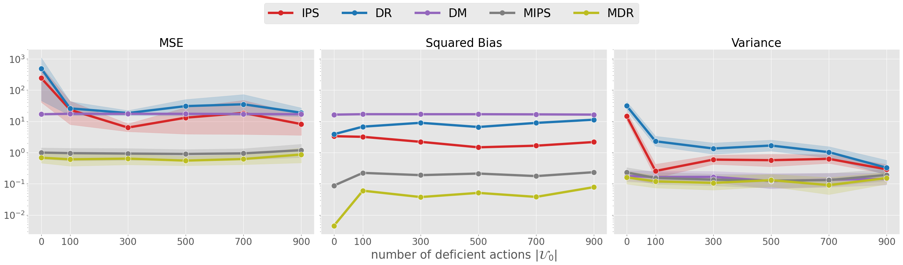
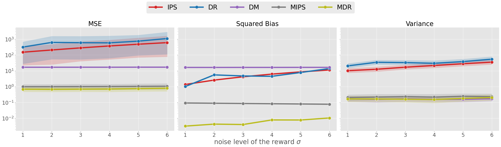

# Doubly Robust Estimator for Off-Policy Evaluation with Large Action Spaces

This repository is for the exeriment conducted in ["Doubly Robust Estimator for Off-Policy Evaluation with Large Action Spaces"](https://arxiv.org/abs/2308.03443) ([IEEE SSCI 2023](https://attend.ieee.org/ssci-2023/))" by [Tatsuhiro Shimizu](https://ss1.xrea.com/tshimizu.s203.xrea.com/works/index.html) and [Laura Forastiere](https://ysph.yale.edu/profile/laura-forastiere/).

## Abstract

We study Off-Policy Evaluation (OPE) in contextual bandit settings with large action spaces. The benchmark estimators suffer from severe bias and variance tradeoffs. Parametric approaches suffer from bias due to difficulty specifying the correct model, whereas ones with importance weight suffer from variance. To overcome these limitations, [Marginalized Inverse Propensity Scoring (MIPS)](https://arxiv.org/abs/2202.06317) was proposed to mitigate the estimator's variance via embeddings of an action. To make the estimator more accurate, we propose the doubly robust estimator of MIPS called the Marginalized Doubly Robust (MDR) estimator. Theoretical analysis shows that the proposed estimator is unbiased under weaker assumptions than MIPS while maintaining variance reduction against IPS, which was the main advantage of MIPS. The empirical experiment verifies the supremacy of MDR against existing estimators.

## Citation

```
@article{shimizu2023doubly,
  title={Doubly Robust Estimator for Off-Policy Evaluation with Large Action Spaces},
  author={Shimizu, Tatsuhiro and Forastiere, Laura},
  journal={arXiv preprint arXiv:2308.03443},
  year={2023}
}
```


## Requirements and Setup
```bash
# clone the repository
git clone https://github.com/tatsu432/DR-estimator-OPE-large-action.git
```

The versions of Python and necessary packages are specified as follows.

```
[tool.poetry.dependencies]
python = ">=3.9,<3.10"
obp = "0.5.5"
scikit-learn = "1.0.2"
pandas = "1.3.5"
scipy = "1.7.3"
numpy = "^1.22.4"
matplotlib = "^3.5.2"
seaborn = "^0.11.2"
hydra-core = "1.0.7"
```


### Section 5: Synthetic Data Experiment
```
# How does MDR perform with varying number of actions?
src/synthetic/main_n_actions.ipynb
```
<div align="center">

</div>

```
# How does MDR perform with varying number of samples?
src/synthetic/main_n_rounds.ipynb
```
<div align="center">

</div>


```
# How does MDR perform with varying beta?
src/synthetic/main_beta.ipynb
```

<div align="center">

</div>

```
# How does MDR perform with varying epsilon?
src/synthetic/main_epsilon.ipynb
```

<div align="center">

</div>

```
# How does MDR perform with varying number of deficient actions?
src/synthetic/main_n_decifient_actions.ipynb
```

<div align="center">

</div>

```
# How does MDR perform with varying standard deviation of reward?
src/synthetic/main_reward_std.ipynb
```

<div align="center">

</div>


```
# How does MDR perform with varying number of category dimensions?
src/synthetic/main_n_cat_dim.ipynb
```

<div align="center">

</div>

```
# How does MDR perform with varying number of categories per dimension?
src/synthetic/main_n_cat_per_dim.ipynb

```

<div align="center">

</div>